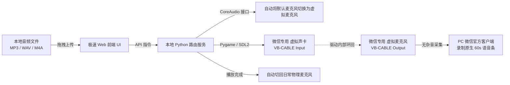

# WeChat Voice Helper (微信音频转语音发送助手)

<p align="center">
  
  
  
  
</p>

一款现代化、安全合规的本地 Windows 音频转微信原生语音辅助工具。可将任意本地音频（MP3、WAV、M4A、AAC、FLAC 等）通过系统驱动级虚拟声卡无损投放，作为微信原生绿色语音气泡（60 秒语音条）发送，无需手动外放对着麦克风录制，无杂音、无电音。

---

## 🌟 核心特性

- 🎨 **现代玻璃拟态 Web UI**：基于现代 Web 标准构建，支持暗黑/明亮系统主题自适应，通过 Microsoft Edge / Chrome 独立 App 模式运行（极简独立窗口，无多余地址栏与工具栏）。
- ⚡ **毫秒级极速解析**：采用前端浏览器沙箱预解析（`HTML5 Audio API`），彻底杜绝旧版同步命令行调用导致的几秒钟冻结与假死，秒级响应。
- 🖱️ **文件拖拽即发 (Drag & Drop)**：支持从电脑任意文件夹直接将音频文件拖入软件窗口，即拖即载。
- 🔄 **智能声卡托管与自动复原**：
  - 点击开始发送后，自动将系统默认麦克风切换为 **微信专用 (虚拟麦克风)**。
  - 提供 3 秒倒计时动画与声音波形反馈，留足时间在微信中按下语音键。
  - 音频播放结束后，**瞬间自动切回日常物理麦克风**（如耳机麦克风或笔记本阵列麦克风），完全不影响后续正常语音通话。
- ✂️ **超长音频一键智能切分**：音频超过 60 秒（微信单条语音上限）时自动智能预警，支持一键分段（默认每段 55 秒），按序号逐条顺畅发送。
- 🛡️ **非注入、零封号风险**：完全在 Windows 操作系统驱动层通过系统底层 CoreAudio API 工作，**不逆向、不修改、不注入、不 Hook 微信任何内存与客户端代码**。

---

## 🛠️ 工作原理



---

## 📦 环境准备与安装

### 1. 安装虚拟声卡驱动 (VB-CABLE)
本项目依赖官方免费虚拟声卡驱动 **VB-CABLE**：
1. 前往官网免费下载：[VB-Audio Virtual Cable 官方网站](https://vb-audio.com/Cable/)
2. 解压下载的压缩包，以**管理员身份运行** `VBCABLE_Setup_x64.exe` 并点击 **Install Driver**。
3. 安装完成后按提示重启电脑（或重启音频服务）。

### 2. 克隆项目与安装 Python 依赖
```bash
git clone https://github.com/hsdbs/wechat-voice-helper.git
cd wechat-voice-helper

# 安装核心依赖 (pygame, imageio-ffmpeg, comtypes)
pip install -r requirements.txt
```

---

## 🚀 启动与使用

### 一键启动
双击运行根目录下的 **`启动微信语音助手.bat`** 即可自动拉起极简桌面窗口。

或通过命令行启动：
```bash
python wechat_voice_web.py
```

### 使用步骤
1. 打开电脑微信，进入目标好友或群聊聊天窗口。
2. 将想要发送的任意音频文件**直接拖入助手窗口**中。
3. 点击 **【▶️ 开始发送】**，助手会自动切换系统麦克风并出现 3 秒倒计时。
4. 倒计时期间，在微信聊天输入框中**按住语音键**（或快捷键 `Alt`）。
5. 音频播放完毕后，助手将提示完成并自动恢复你的原麦克风，此时**松开微信语音键**即可成功发出原生语音条！

---

## ⚠️ 免责声明与法律声明 (Disclaimer)

请在下载、安装或使用本项目代码前仔细阅读以下条款：

1. **用途限制与合规要求**：
   本项目仅供**计算机软件技术研究、自动化音频路由技术学习及个人无障碍辅助交流**使用。严禁将本项目用于任何违法犯罪活动，包括但不限于电信网络诈骗、伪造他人声音借款欺诈、恶意骚扰、虚假宣传、侵犯他人名誉权或肖像权等违法行为。使用者因违反相关法律法规而导致的一切法律后果与民事/刑事责任，**均由使用者独立承担，本项目作者及贡献者概不承担任何直接、间接或连带责任**。

2. **技术中立与非侵入声明**：
   本项目属于纯粹的音频路由与本地输入辅助工具。程序仅调用 Windows 操作系统公开的 CoreAudio API 进行音频端点配置，并利用系统合法的虚拟声卡驱动进行信号转发。**本项目绝对不包含任何针对微信（WeChat）客户端的逆向工程、反编译、内存注入、DLL 劫持、网络协议破解或 Hook 拦截行为**。程序运行期间微信客户端保持完整且未受任何修改。

3. **第三方商标与知识产权声明**：
   - “微信”及“WeChat”为腾讯科技（深圳）有限公司的注册商标。本项目与腾讯公司不存在任何形式的商业合作、官方认可、投资或关联关系。
   - “VB-CABLE”商标及驱动程序版权归属于 [VB-Audio Software](https://vb-audio.com/)。本项目不分发其专有闭源驱动。

4. **隐私与安全承诺**：
   本项目为 100% 本地运行程序，所有 HTTP 接口及音频数据均限制在回环地址 `127.0.0.1` 处理。程序不包含任何数据上传代码，不收集用户的任何聊天记录、隐私数据或音频文件。

---

## 📄 开源许可证

本项目采用 [MIT 许可证](LICENSE) 开源。
